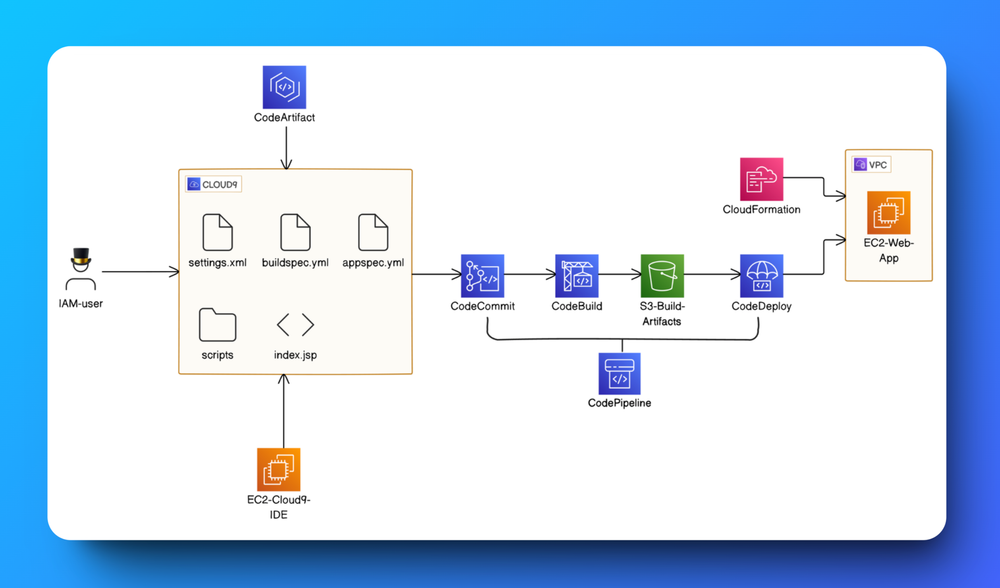

# AWSxDevOps
Welcome to this AWSxDevOps project series! In this SEVEN-project series, I will create a CI/CD pipeline to build and deploy a simple web application using AWS' Code services.

## Here's what you'll build at the end of ALL seven projects:

Welcome to this DevOps project! In this guide, I'll share how to host a static website using Amazon S3, a highly scalable storage service provided by AWS. By the end of this project, I'll have my website hosted and publicly accessible on the web.

## Yup. I'll build all of this from scratch - and we'll do every step together

## Table of Contents

- [Prerequisites](#prerequisites)
- Series:
  - [Series I: Setting Up a Web App and IDE with Cloud9](AWSxDevOps/Series-I/README.md)
  - [Series II: Setting Up A Git Repository with AWS CodeCommit](Series-II/readme.md)
  - [Series III: Secure Project Dependencies with AWS CodeArtifact](Series-III/readme.md)
  - [Series IV: Package an App with CodeBuild](Series-IV/readme.md)
  - [Series V: Deploy an App with AWS CodeDeploy](Series-V/readme.md)
  - [Series VI: Automate with CloudFormation](Series-VI/readme.md)
  - [Series VII: CI/CD with CodePipeline](Series-VII/readme.md)
- [License](LICENSE)

## Prerequisites

- An [AWS account](https://aws.amazon.com/free/) (Free Tier eligible)
- Basic knowledge of HTML

## What is DevOps?
In the real world, developers are often working in teams and collaborating on complex software projects. Managing the many changes can get messy without the right systems in place.

**DevOps engineers** work to bridge the gap between developers (Dev), who build the software, and operations (Ops), who deploy and manage it. On a day to day basis, DevOps engineers work on automating and optimizing processes in all stages of making software, from integration, testing, releasing to deployment. Essentially, they make building software faster, less error-prone, and more secure.

## What is a CI/CD pipeline?

A CI/CD pipeline is a tool that automates the process software goes through from development (i.e. being coded up by engineers) to deployment (i.e. made available to users).
  - **"CI" stands for continuous integration**, where code changes are automatically updated and integrated into what other developers are working on.
  - **"CD" stands for continuous deployment**, which automates releasing new software to actual users.
Teams use CI/CD to make their workflow smoother and to cut down on manual tasks, which helps them deliver new features to users, fix bugs much quicker and work with less chance of errors.

CI/CD is a KEY concept in the world of DevOps. Improving software delivery speed and quality using automation and streamlined workflows is what DevOps is all about!

## Delete Your Resources

To avoid unnecessary charges, make sure to delete all AWS resources after completing the project:

1. Delete the `Cloud9 environment`.
2. Delete the `CloudFormation stack`.
3. Delete the `CodePipeline`.
4. Delete the `CodeDeploy application`.
5. Delete the `S3 bucket`.
6. Delete the `IAM Roles & Policies`.
7. Delete the `CloudWatch Log Group`.
8. Delete the `EC2 Instances`.

This project is licensed under the MIT License. See the [LICENSE](LICENSE) file for details.

## Let's Connect

Feel free to reach out or follow me for more updates on my journey through AWS and DevOps!

**Happy Hosting!** 🌟
