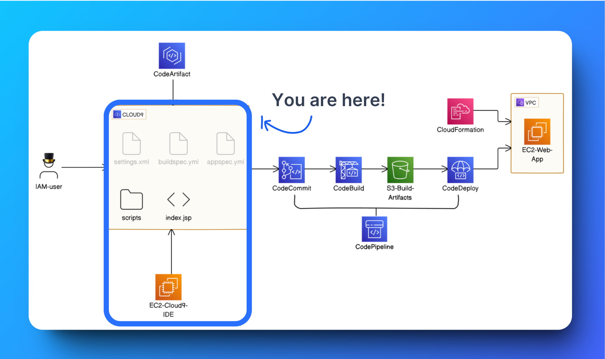
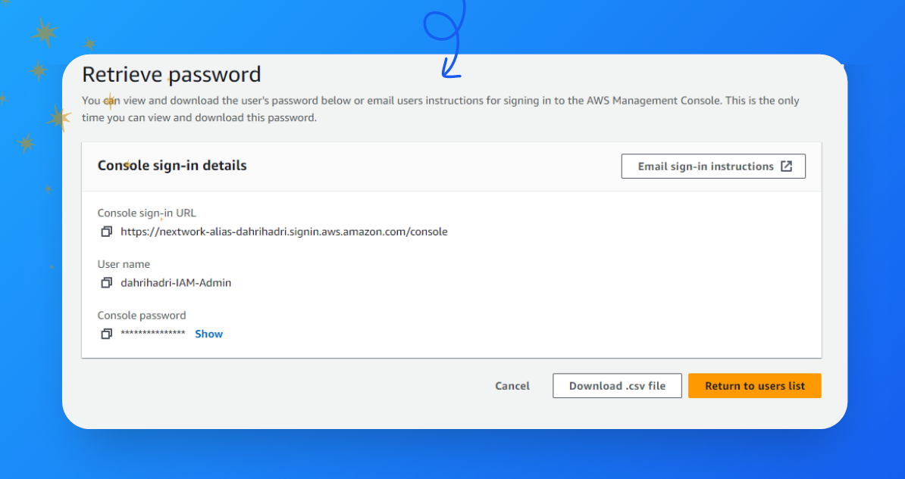
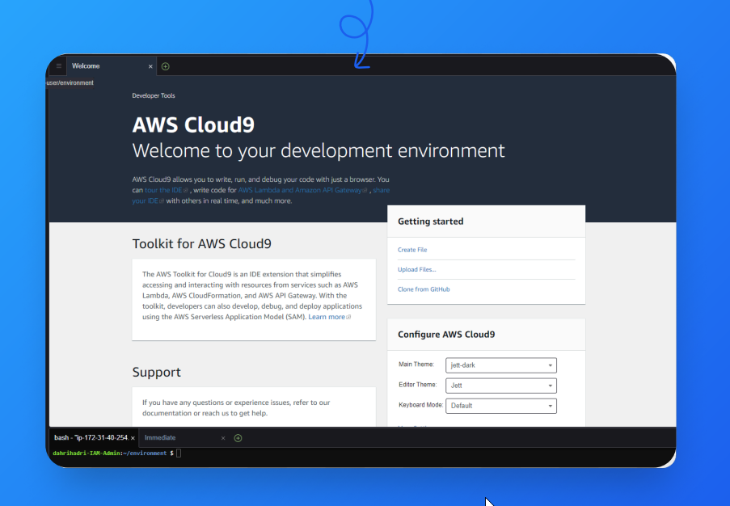
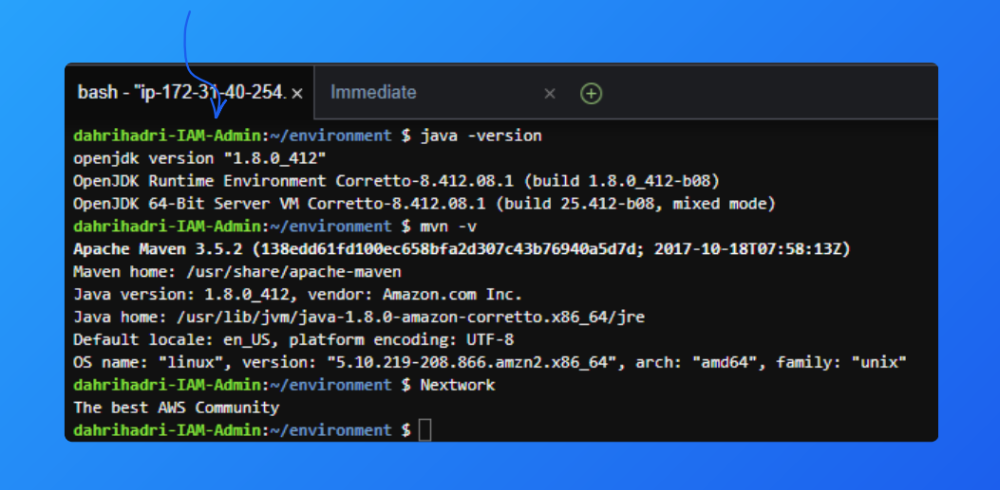
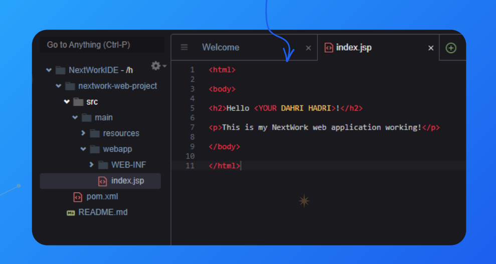

# AWSxDevOps Series I - Setting Up a Web App and IDE with Cloud9
In the first project of this series, I will share the basics of building a web app and IDE using Cloud9. This will lay the foundations for my DevOps work across the next six projects!



## Introducing AWS Cloud9!

### What it does & how it’s useful
AWS Cloud9 is a cloud-based IDE that lets you write, run, and debug code with just a browser. Developers and teams use AWS Cloud9 because it includes essential tools, supports collaboration, and eliminates the need for local setups.

### How I’m using it in today’s project
I’m using AWS Cloud9 to set up an IDE for developing a web application. It streamlines my workflow by providing a browser-based environment with all necessary tools pre-installed.

### This project took me
This project took me about 30 minutes to complete. Documentation took me an additional 30 minutes. Keeping track of everything in detail was crucial for understanding and replicating the process.

**Difficulty**: Easy peasy  
**Time**: 1 hour  
**Cost**: $0  
**Tools Needed**:
- An AWS account - [Create one here!](https://aws.amazon.com/free/)

## AWS Services Used

- Amazon Cloud9
- Amazon IAM
- Amazon EC2

## What I'll share in this first project series:

   - 💂 `Set up an IAM user`: How I created a new IAM user with admin permissions to provide a safer alternative to using the AWS root account for ongoing projects. 
   - ☁️ `Launch a new Cloud9 IDE`: How I set up a new Cloud9 IDE environment to write, run, and debug code without installing heavy software locally. 
   - ⬇️ `Install Maven & Java`: How I installed Apache Maven and Amazon Corretto 8 on my Cloud9 IDE to manage my project's dependencies for developing a Java web application. 
   - 🏗️ `Create the application`: Using Maven, how I generated a new Java web app from a template, creating a basic project structure and environment for further development. 

## Table of Contents

- [Prerequisites](#prerequisites)
- [Steps](#steps)
  - [Step 1: Set up an IAM User](#step-1-set-up-an-iam-user)
  - [Step 2: Launch a Cloud9 IDE](#step-2-launch-a-cloud9-ide)
  - [Step 3: Install Maven & Java](#step-3-install-maven-and-java)
  - [Step 4: Create the application](#step-4-create-the-application)
- [My key learning](#my-key-learning)
- [License](#license)

## Prerequisites

- An [AWS account](https://aws.amazon.com/free/) (Free Tier eligible)
- Basic knowledge of HTML

## Steps

### Step 1: Set up an IAM User

- An `IAM user` is an additional user that can access AWS resources with permissions specified by the account owner. 
- It’s important to create `IAM users` because the root user is vulnerable to security breaches, and `IAM users` allow for controlled access to resources.
- I created an `IAM user` with administrator access, allowing it to perform all actions on all resources in my account.

<p align="center">A new IAM user set up for my AWS Account</p>




### Step 2: Launch a Cloud9 IDE

- An IDE is a software tool that helps developers write, test, and debug code efficiently in a single integrated environment.
- I used `AWS Cloud9` to launch an environment. An environment means a configured setup that provides the necessary tools and settings for software development.
- Using `Cloud9` meant having a flexible and accessible IDE hosted on AWS, eliminating the need for local installations and ensuring consistent development environments.

<p align="center">My Cloud9 IDE!</p> 

   

### Step 3: Install Maven and Java

- `Maven` is a powerful build automation tool used primarily for `Java` projects to manage dependencies, build processes, and project lifecycles efficiently. 
- `Maven` is required in this project because it automates tasks like compiling, testing, and packaging Java applications, ensuring smooth and standardized project builds.
- I run these commands
```bash
sudo wget https://repos.fedorapeople.org/repos/dchen/apache-maven/epel-apache-maven.repo -O /etc/yum.repos.d/epel-apache-maven.repo

sudo sed -i s/\$releasever/6/g /etc/yum.repos.d/epel-apache-maven.repo
‍
sudo yum install -y apache-maven
```
  
- `Java` is a widely used programming language known for its portability, reliability, and scalability, making it suitable for various applications and environments. 
- `Java` is required in this project because it serves as the foundational programming language for building and running the Java-based web application using AWS services. 
- The `Java` version I’m using for this project is `version 1.8.0` 
- I run these commands
```bash
sudo amazon-linux-extras enable corretto8

sudo yum install -y java-1.8.0-amazon-corretto-devel

export JAVA_HOME=/usr/lib/jvm/java-1.8.0-amazon-corretto.x86_64

export PATH=/usr/lib/jvm/java-1.8.0-amazon-corretto.x86_64/jre/bin/:$PATH
```

<p align="center">I used terminal commands to install Maven and Java</p> 

   


### Step 4: Create the application

- To create a simple Java web app, I ran the command mvn `archetype:generate` `-DgroupId=com.nextwork.app` `-DartifactId=nextwork-web-project` `-DarchetypeArtifactId=mavenarchetype-webapp` `-DinteractiveMode=false`. 
```bash
mvn archetype:generate \
   -DgroupId=com.nextwork.app \
   -DartifactId=nextwork-web-project \
   -DarchetypeArtifactId=maven-archetype-webapp \
   -DinteractiveMode=false
```
- Once the web app was created, my IDE's file explorer showed a new directory named `nextwork-web-project`, containing the initial structure of the Maven-based web application.
- To customize this web app's display, I will edit the `index.jsp` file in my project, which contains the markup for the web page.
```bash
<html>

<body>

<h2>Hello <YOUR NAME>!</h2>

<p>This is my NextWork web application working!</p>

</body>

</html>
```
<p align="center">Writing a basic web app in my Cloud9 IDE!</p> 

   

### My key learning

1. It’s recommended to use an IAM user instead of the root user for projects because IAM users offer scoped permissions, reducing the risk of unauthorized access and potential security breaches to critical AWS resources. 
2. IDEs are useful for developers as they provide integrated tools for coding, debugging, and managing software projects efficiently in a unified environment, enhancing productivity and collaboration.
3. Apache Maven is used in my project to automate the build process, manage dependencies, and streamline project management tasks, ensuring efficient development and deployment of Java-based applications.
4. One thing I didn’t expect was the depth of customization and automation capabilities that AWS Cloud9 offers, enhancing my development workflow significantly. 

## Great! 
### We are done with series I

   

## Find this helpful?
Let's Connect and Feel free to reach out or follow me in [LinkedIn](https://www.linkedin.com/in/dahrihadri) for more updates on my journey through AWS and DevOps!

## License

This project is licensed under the MIT License. See the [LICENSE](LICENSE) file for details.

# Lets continue our AWSXDevOps project in [Series II](https://github.com/dahrihadri/AWSxDevOps/tree/main/Series-II) ! 🌟
